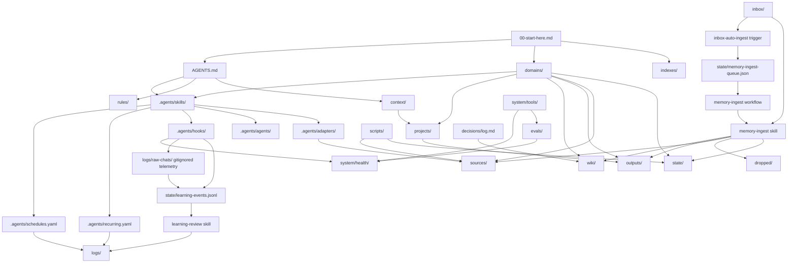

# Project Map

Agentic Business OS is a single-project operating system for local-first agentic work. The repo root is both the runtime workspace and the knowledge vault.

Retired roots: do not recreate broad unclassified folders such as `memory/`, `research/`, or `processed/`. Use the active memory spine instead.

Companion text map: [agentic-os-text-map.md](agentic-os-text-map.md).

## System Diagram

## Root Folder Contract

| Folder | What Goes Here | What Must Not Go Here | First File |
| --- | --- | --- | --- |
| `.agents/` | Skills, agents, hooks, adapters, schedules, recurring obligations, and templates | Business context, final reports, raw exports | `.agents/skills/README.md` |
| `.claude/` | Claude Code config and optional commands | Durable project knowledge or committed secrets | `.claude/settings.local.json` is gitignored |
| `.codex/` | Codex project config and optional MCP setup | Shared workflow docs that should apply to all runtimes | `.codex/config.toml` |
| `archives/` | Inactive completed or parked work | Active workstream material | `archives/README.md` |
| `context/` | Current operating truth: priorities, goals, business context, tool stack | Long generated reports or raw data dumps | `context/README.md` |
| `decisions/` | Append-only decisions that changed direction or policy | Daily notes, drafts, or raw evidence | `decisions/log.md` |
| `domains/` | Domain ownership contracts: KPIs, skills, agents, outputs, active projects | Detailed procedures or long analysis | `domains/README.md` |
| `dropped/` | Rejected inbox/source material with enough reason to avoid reprocessing | Useful evidence or unreviewed material | `dropped/README.md` |
| `evals/` | Fixtures for testing routing, skills, hooks, adapters, and memory behavior | Production reports or long run outputs | `evals/README.md` |
| `inbox/` | Generated artifacts, source drops, transcripts, candidate insights, and ingest envelopes before classification | Accepted final deliverables | `inbox/README.md` |
| `indexes/` | Navigation spine for folders, skills, sources, outputs, hooks, adapters, and this project map | Primary knowledge that belongs in wiki/context/projects | `indexes/README.md` |
| `logs/` | Runtime logs, scheduler briefs, run traces, and operational evidence | Durable synthesis or final deliverables | `logs/README.md` |
| `outputs/` | Final human-facing reports, dashboards, briefs, drafts, images, and system eval reports | Raw exports or unresolved generated material | `outputs/README.md` |
| `projects/` | Active/background workstream workspaces, plans, handoffs, and project indexes | Global rules, final report shelves, raw data exports | `projects/README.md` |
| `references/` | Stable SOPs, guidebooks, examples, and durable reference material | Daily status or one-off generated artifacts | `references/README.md` |
| `rules/` | Reusable communication, data analysis, memory, and project-convention rules | Workflow procedures that should be skills | `rules/README.md` |
| `scripts/` | Deterministic project-owned scripts for APIs, reports, and automation | Generated report output or hidden knowledge | `scripts/README.md` |
| `sources/` | Source cards, source contracts, raw exports, adapter evidence | Final reports or rolling metric histories | `sources/README.md` |
| `state/` | Manifests, queues, and machine-readable histories | Human-facing reports or handwritten narrative logs | `state/README.md` |
| `system/` | Tools, schemas, tests, health reports, context loader, audits | Business decisions or project-specific plans | `system/README.md` |
| `templates/` | Reusable local templates for skills, envelopes, reports, or docs | One-off generated artifacts | `templates/README.md` |
| `tmp/` | Temporary scratch workspace | Durable knowledge, outputs, or source evidence | none |
| `wiki/` | Short durable synthesis promoted by ingest and linked from indexes | Long reports, raw exports, or unreviewed notes | `wiki/README.md` |

## Artifact Routing

| Artifact Type | First Stop | Final Home |
| --- | --- | --- |
| New generated report with possible durable value | `inbox/<workflow>/YYYY-MM-DD/` | `outputs/<workflow>/` after ingest or approval |
| Raw API or tool export | direct script output | `sources/data/<provider-or-system>/` |
| Rolling machine-readable history | direct skill write | `state/metrics/<workflow>/` or another state file |
| Durable insight extracted from a report | `inbox/` candidate | short linked page in `wiki/` |
| Rejected input | `inbox/` | `dropped/` with reason |
| Process-only input | `inbox/` | manifest record in `state/ingest-manifest.json`; no retained copy unless routed to `sources/`, `outputs/`, or `archives/` |
| Active workstream plan | `projects/<workstream>/` | stays there until archived |
| Meaningful strategic decision | direct append | `decisions/log.md` |
| Compact self-learning event | `state/learning-events.jsonl` | `logs/learning/` review brief, then approved patch/inbox/project/recurring update |
| Ephemeral raw chat capture | gitignored `logs/raw-chats/` | parsed to `state/learning-events.jsonl`, then deleted on retention schedule |

## Read Path For Agents

1. Read `00-start-here.md`.
2. Load the relevant domain file from `domains/`.
3. Load the matching skill under `.agents/skills/` if a workflow applies.
4. Use `system/tools/context_loader.py` when ownership is unclear.
5. Read only the linked context, wiki, output, source, or project file needed for the task.
6. Put new generated artifacts with possible durable value in `inbox/`.
